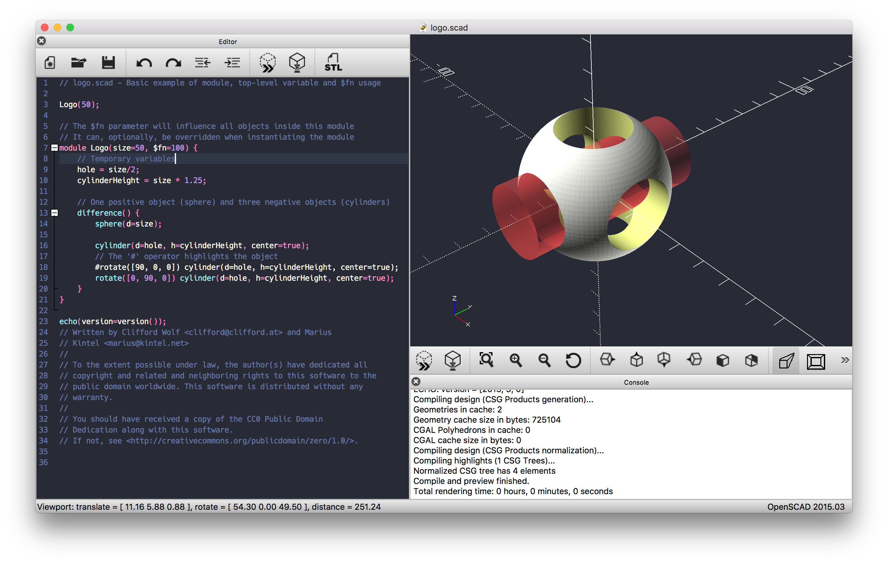

# Dracula theme for OpenSCAD



To install, copy the json files to the appropriate directories.

For example, on macOS, assuming OpenSCAD is installed to /Applications:

```Shell
$ cp editor/dracula.json /Applications/OpenSCAD.app/Contents/Resources/color-schemes/editor/
$ cp render/dracula.json /Applications/OpenSCAD.app/Contents/Resources/color-schemes/render/
```
